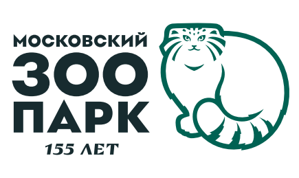

# Telegram-бот для Московского Зоопарка

## Содержание
- [Описание бота](#описание-бота)
- [Возможности бота](#возможности-бота)
- [Установка, настройка и запуск](#установка-настройка-и-запуск)
- [Файловая структура проекта](#файловая-структура-проекта)

## Стек технологий
- python 3.8
- asyncio
- aiosqlit
- aiogram 3.10
- sqlalchemy 2.0.31

## Описание бота
Этот telegram-бот написан к дополнению основного телеграм-канала и сайта **Московского Зоопарка**. \
Бот содержит в себе викторину на тему "Какое Ваше тотемное животное" и дополнительную 
информацию про существующую **программу опеки** Московского Зоопарка. \
**Цель бота**, привлечь внимание к програме и помочь пользоваателю подобрать животное для опекунства.

### Возможности бота
- Модуль викторины "Какое твоё тотемное животное"
- Информация о программе опеки
- Модуль обратной связи (связь с сотрудником)
- Механизм по сохранению отзывов от пользователей
- Механизм, позволяющий отправить результат прохождения викторины
- Скрытый модуль Администрирования бота

Бот реализован на языке python 3.8, с применением библиотеки aiogram и спроектирован таким образом, 
чтобы устойчиво работать с большим количеством пользователей.
Архитектура бота написана так, чтобы у пользователя, при переписке с ботом,  не возникло трудностей по
взаимодействию с ним. В боте используются InlineKeyboardBuilder кнопки и механизмы по удалению/редактированию
сообщений, чтобы визуально информация была в одном месте. \
У бота есть логика по взаимодейстию с базой данной SQLite. Вся нужная для работы бота информация хранится
там (кроме картинок). \
В проекте уже есть готовая база данных (**database_bot.db**). Также лежит отдельно файл по  
 разворачиванию базы данных с нуля (**deploy_database.py**), файл с данными для 
викторины (**questions_db.json**) и фото животных, которые будут отображаться с текстом 
после прохождения викторины (**modul_quiz/foto**), чтобы можно было легко сопровождать бота. \
Можно создать свои данные для викторины, а потом развернуть базу. 

#### Модуль викторины
Сама викторина выполнена в виде последовательных вопросов, которые в конце определяют результат 
пользователя на основе данных им ответов. Для определения итогового результата
используется система "взвешенных" ответов (питомец, набравший больше всего баллов - побеждает). \
По умолчанию в настройка бота выставлено 5 вопрос, но количество можно менять.
Каждый раз, когда пользователь будет проходить викторину, вопросы будут меняться. Вопросы выбираются 
случайно из общего списка вопросов, которые хранятся в базе данных.
- Если всего вопросов в базе 10, а в настройках бота указано показывать 11 вопросов - бот будет отображать 10
вопросов без сортировки.
- Если всего вопросов в базе 10, а показать нужно 7 - бот будет выбирать 7 случайных вопросов каждый раз, как
пользователь зайдет в модуль с викториной.
- Если в базе нет вопросов - бот отобразит техническую ошибку и в целом, модуль с викториной будет недоступен.

#### Информация о программе опеки
Основная задача бота, рассказать о существовании программы опеки животных московского зоопарка.
Чтобы это было не навязчиво, было принято решение вынести это в отдельную страницу, при нажатии 
определенных кнопок. \
Информация ввыводится просто текстовым сообщением, а чтобы узнать о программе подробнее, есть **кнопка
обратной связи** при нажатии на которую появится информация, как связаться с менеджером. А менеджеру
отправится копия сообщения с результатом прохождения викторины и имя пользователя, который прошел викторину. \
Данные менеджера можно настроить в настройках бота.

#### Cохранение отзывов от пользователей
При нажатии на кнопку **"Оставить отзыв"**, бот сохраняет то, что написал пользователь в текстовое
поле в базу данны. В целях сохранения персональных данных, бот записывает только сам отзыв и имя пользователя. 
(_никакие id телеграма и прочая статистика аккаунтов не собирается!_)

#### Возможность поделиться результатом
У бота есть возможность **"Поделиться результатом"** в виде отдельной inline кнопки. \
Нажав на неё, можно переслать текст с результатом викторины другу.

#### Администрирование бота
Чтобы воспользоваться модулем администрирования, нужно ввести команду **/admin**. Она предназначена
для управления викториной бота через телеграм, а также там есть опция просмотра последних отзывов
(если они есть). \
По умолчанию данная команда нигде не отображается. Пользоваться ей могут только пользователи, 
чьи id телеграма были добавлены в настройки бота.

## Установка, настройка и запуск
1. Убедитесь, что у вас установлен python версии 3.8.
2. Клонируйте этот репозиторий: `https://github.com/kostobot/TG_Bot_MskZoo.git`
3. Установить необходимые библиотеки из файла requirements.txt `pip install -r requirements.txt`
4. Настройте конфиг (.env). 
   1. (необязательный шаг) Чтобы администрировать бота через телеграм, укажите в переменную 
   **ADMIN_USER** id телеграм пользователей у которых будут доступ к команде **/admin**
   2. Пропишите токен бота.
5. Разверните базу данных (необязательный шаг. Файл с базой есть в проекте).
   1. (необязательный шаг) У бота есть файл **modul_quiz/questions_db.json** в котором описаны 
   стартовые вопросы по викторине.
   Если хотите составить свой список - поправте этот файл.
   2. Запустите файл **deploy_database.py**. Таким образом вы создадите у себя базу данных 
   (**database_bot.db**), в которой уже будут данные для викторины.
6. Запустите проект: `python app.py`

.env: \
**TOKEN** - токен бота \
**DB_URL** - путь до базы данных \
**COL_QUESTIONS** - отвечает за количество вопросов в викторине \
**ADMIN_USER** - id телеграм пользователей, которым будет доступен модуль администрирования бота 
(можно оставить пустым)

Контактная информация менеджера, которая отображается пользователю при нажатии
на кнопку "Связь с сотрудником" (по умолчанию указаны тестовые данные) \
**MANAGER_NAME** - Имя \
**MANAGER_EMAIL** - email адрес \
**MANAGER_PHONE** - телефон \
**MANAGER_TELEGRAM_ID** - id телеграм пользователя, которому отправится копия сообщения 
когда кто-то нажмет кнопку "Связь с сотрудником"

## Файловая структура проекта
~~~python
telegram_bot_moscowzoo/
├── database/
│   ├── engine.py
│   ├── middleware.py # Для взаимодействия бота с базой
│   ├── models.py # Модели таблиц базы
│   └── orm_requests.py # Запросы к базе данных
├── files/ # Файлы для README.md
│   └── files_readme/
│       └── ...
├── handlers/
│   ├── admin_handlers.py # Описание команд бота для администрирования
│   ├── content_for_pages.py # Тут происходит формирование контента для "страниц" бота
│   └── user_handlers.py # Обработка команд от пользователя
├── keyboards/
│   ├── image_start.PNG # Картинка, которая отображается по приветствию пользователя
│   └── inline.py # Описание кнопок бота
├── modul_quiz/
│   ├── foto/
│   │   ├── ... # Фото для викторины
│   └── questions_db.json # Данные для викторины
├── app.py
├── database_bot.db # База данных
├── deploy_database.py # Для создания базы данных и добавления вопросов для викторины из questions_db.json
├── kill_database.py
├── README.md
├── requirements.txt
~~~